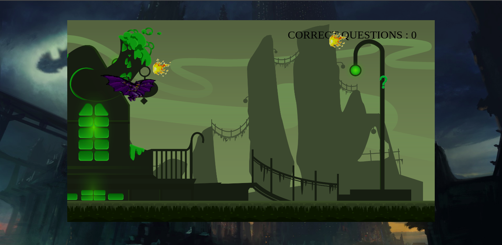
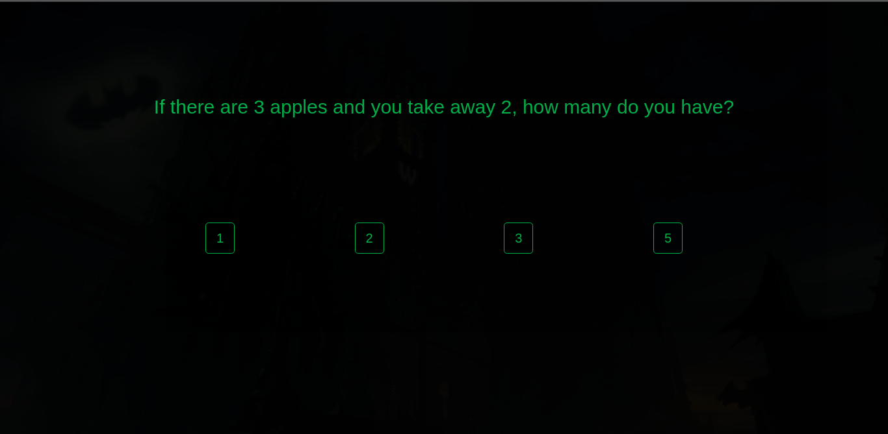
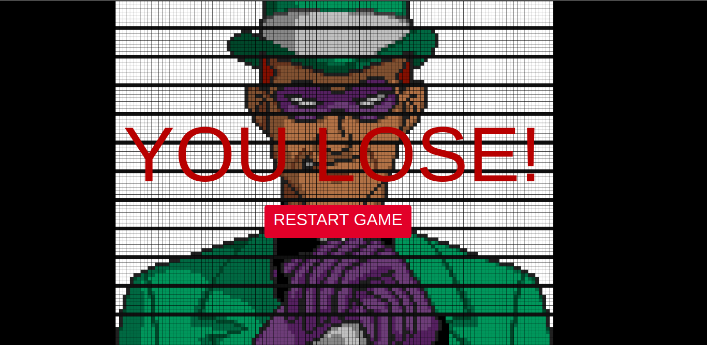

# The Iron Knight Game
> "The Iron Knight Game" is a game build in HTML canvas, CSS and Javascript.
#### : https://newericg.github.io/theironknight/

## Installation

Clone or download this project, open the index.html file in your browser and have Fun. Or just click in this [link](https://heitorgodau.github.io/ironquest-the-game/)!

## Usage example

Instructions to play this game:

* Use your Keyboard
* Use arrow Up and Down do move the player.
* Dodge the fireballs
* Collect the question marks
* Answer the questions correct.
* Defeat the Riddler.

## Release History

* 1.2.1
    * CHANGE: Minor bugs fixed
* 1.2.0
    * CHANGE: Questions count added
* 1.1.0
    * CHANGE: Background music and sound FX are implemented
* 1.0.0
    * First functional release
* 0.4.0
    * CHANGE: Questions screen added
* 0.3.0
    * CHANGE: Collision logic was implemented
* 0.2.0
    * CHANGE: Canvas added.
* 0.1.0
    * CHANGE: History Screen added
* 0.0.1
    * Initial files added

